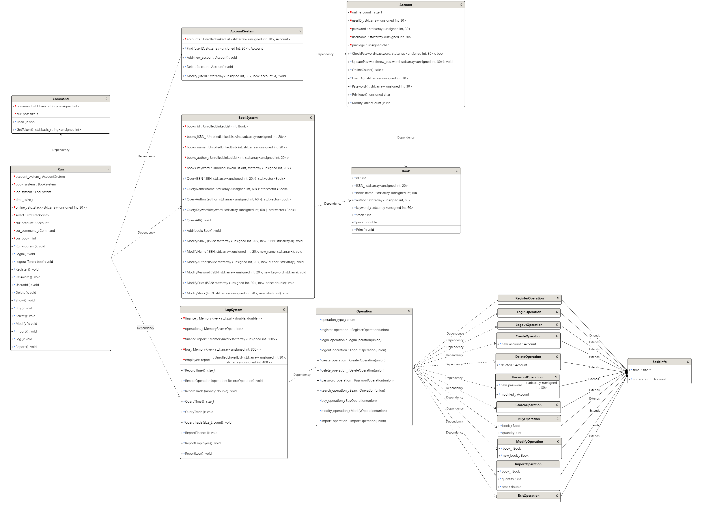

# Bookstore 总体设计文档

author:王健豪

## 程序功能概述

这是一个由 **C++** 语言实现的书店管理系统，使用命令行的方式与用户进行交互。该系统为店主、员工、顾客服务，提供注册、登录、注销、查书、买书等服务。员工和店主可以对书店进行管理，如进货、添加图书信息、修改图书信息。店主拥有最高权限，还可以查看书店的工作日志、财务情况等。

该程序在第一次运行时将创建唯一的店主账户，且该系统允许嵌套登录，输入的指令视为最后一个处于登录的状态的账户操作。没有账户登录时视为游客模式，只能执行注册、登录操作。

## 主体逻辑说明

整体采用面向对象编程，分为以下几个模块：

- 前端
- 命令捕获
- 账户信息管理
- 图书信息管理
- 操作日志
- 文件操作

程序运行时，前端捕获命令，并作出相应的处理（管理账户信息/管理图书信息/输出操作日志）。

## 代码文件结构

备注：对应名称的 `.h` 文件包含所有对应 `.cpp` 实现内容的声明

1. `main.cpp`
  
    程序的主入口点，负责启动前端。

2. `front_end.cpp`

    实现了“前端”类，包含程序运行，其通过不断捕获 `command` 以执行对应指令，包含账户注册、账户登录、账户注销、账户创建、账户删除、修改密码，图书检索、图书购买、选择图书、图书信息修改、进货，财务记录查询、生成财务报告、生成员工工作报告、生成日志。

3. `command.cpp`

    实现了“命令”类，包含对命令的读取、命令要素的获取，并将对应的信息返回给“前端”类。

    实现了将命令要素转化为各种所需数据的函数。

4. `account.cpp`

    实现了“账户”类，包含密码检查、密码修改、返回是否已经登录、返回 [UserID]、返回 [Privilege]。

    实现了“账户系统”类，包含查找账户、添加账户、删除账户、修改账户。

5. `book.cpp` 

    实现了“图书”类，包含输出图书信息、修改图书信息、减少库存、增加库存。

    实现了“图书系统”类，包含用 [ISBN] / [Bookname] / [Author] / [Keyword] (单个) 查询图书、修改图书信息，以及添加图书

6. `log.cpp`

    实现了“日志”类，包含记录交易、记录操作、财务记录查询、生成财务报告、生成员工工作报告、生成日志。

    实现了“操作”集合，包含注册操作、登录操作、注销操作、创建账户操作、删除账户操作、修改密码操作、检索图书操作、购买图书操作、修改图书信息操作、进货操作、退出操作。

7. `unrolled_linked_list.hpp`

    实现了“块状链表”类，用于存储账户信息、图书信息、财务记录、日志信息等，包含插入信息、查找信息、删除信息、返回全部信息。

8. `memory_river.hpp`

    声明并实现了“文件操作”类，包含写入信息、修改信息、读取信息。

## 功能设计

备注：文件操作模块在账户信息管理模块、图书信息管理模块和操作日志模块的所有操作中均有涉及，用于记录、查询、删除信息。 为了图片美观，在此文字说明这个模块而不是画在图上。

## 数据库设计

账户信息文件（两个，head/body）：每个记录包含账户 (`class`)，块状链表存储，`key` 为 [UserID]。

图书信息文件1（两个，head/body）：每个记录包含图书 (`class`)，块状链表存储，`key` 为 [ISBN]。

图书信息文件2（两个，head/body）：每个记录包含 [ISBN] (`std::array<char, 20>`)，块状链表存储，`key` 为 [Bookname]。

图书信息文件3（两个，head/body）：每个记录包含 [ISBN] (`std::array<char, 20>`)，块状链表存储，`key` 为 [Author]。

图书信息文件4（两个，head/body）：每个记录包含 [ISBN] (`std::array<char, 20>`)，块状链表存储，`key` 为 [Keyword] (单个)。

财务信息文件：记录了当前的时间，其他每个记录包含前 $n$ 笔交易支出的前缀和 (`double`)、前 $n$ 笔交易收入的前缀和 (`double`), `MemoryRiver` 存储。

操作记录文件：每个记录包含操作，`MemoryRiver` 存储。

总计 $12$ 个文件。

## 类、结构体设计

备注：`MemoryRiver` 和 `UnrolledLinkedList` 两个文件操作类与 Bookstore 的整体实现相对独立，可以当作黑盒使用。其中`MemoryRiver` 是允许在文件中存储若干个 `size_t` 类型和若干个某一定长类型的变量，而 `UnrolledLinkedList` 允许在文件中有序存储若干 `(key,value)`。

## 其他补充说明