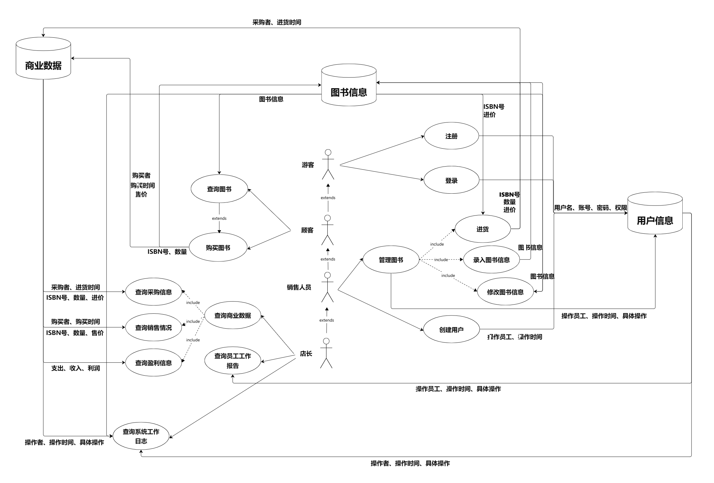

# Bookstore 需求分析文档

## 业务流图

## 数据流图

## 数据词典

- 图书信息: ISBN 号，书名，作者，关键字，库存量，单价
  
  ISBN号: 字符串，$20$ 个字符，每本书唯一

  书名: 字符串，不超过 $60$ 个字符

  作者: 字符串，不超过 $60$ 个字符

  关键字: $1$ 个或多个字符串，总共不超过 $60$ 个字符

  库存量/数量: 整数

  单价/售价: 非负实数

- 用户信息: 用户名，账号，密码，权限

  用户名: 字符串，不超过 $60$ 个字符

  账号: 字符串，不超过 $60$ 个字符

  密码: 字符串，不超过 $60$ 个字符

  权限: $\{1,2,3,4\}$ 中的一个，$1$ 表示游客，$2$ 表示顾客，$3$ 表示销售人员，$4$ 表示店长

- 商业数据: 操作者/采购者/购买者/操作员工，操作时间/进货时间/购买时间，具体操作 
  
  操作者/采购者/购买者/操作员工: 用户名

  操作时间/进货时间/购买时间: 非负整数

  进价: 非负实数
  
  支出: 非负实数

  收入: 非负实数

  利润: 实数

- 具体操作: ISBN 号，数量，操作类型，进价或售价或图书信息 （分别表示进货，购买，查询/录入/修改图书信息）
  
  操作类型：$\{1,2,3,4,5\}$ 中的一个，$1$ 表示进货，$2$ 表示购买，$3$ 表示查询图书信息，$4$ 表示录入图书信息，$5$ 表示修改图书信息

## 功能说明

备注：

1. 执行所有功能时，先输入该功能的名称。
2. 所有无法识别的输入（如输入密码时输入了 $66$ 个字符），均要求用户重新输入。
3. 初始时时间为 $0$ ，每次操作后时间加 $1$。

### 登录模块

- 功能1: 注册

  输入用户名和密码，系统自动分配账号。

  输出 “注册成功” 和对应的账号。

  首次运行时，用户权限为店长。 其余情况设置权限为游客。

- 功能2: 登录

  输入账号和密码，如果密码正确就成功登录，并输出 “登录成功”，否则要求重新输入。

  允许重复登录，以最后一次成功的登录操作的对象为当前操作对象。

- 功能3：注销

  输入特定标识符以注销，输出“注销成功”。操作对象会跳转至上一个成功登录的对象。

- 功能4: 创建用户

  只有店长和销售员可以创建用户。如果权限不够则输出 “权限不够”。  

  否则输入用户名、密码和权限，其中权限必须严格低于创建者的权限，系统自动分配账号，如果不满足要求，则输出 “你无法设置该权限”，并要求重新输入，成功创建后输出 “创建成功” 和对应的账号。

  将此次创建用户操作时间、操作结果存储在操作者的信息中
 
### 图书操作模块

- 功能1：查询图书
  
  游客不能查询图书，输出 “权限不够”。

  输入 ISBN 号、作者名字、关键字、书名中的任意组合，其中每种输入前需加标识符。

  输出所有完全符合输入信息的图书的所有信息。如果没有符号条件的图书，则输出 “未查询到相关图书”

- 功能2: 购买图书

  游客不能购买图书，输出 “权限不够”。

  输入 ISBN 号和购买数量。如果不存在该书，则输出 “购买的图书不存在”；如果数量不足，则输出 “库存不足”；否则，输出 “购买成功” 以及单价和总价，并修改此书的数量，更新支出和利润，将购买的信息存入商业数据中。

- 功能3: 进货

  游客和顾客不能进货，输出 “权限不够”。

  输入 ISBN 号、数量和进货价格。若不存在该书，则输出 “该书不存在” ； 否则输出 “进货成功” 和总花费，并修改此书的数量，更新收入和利润，将进货的信息存入商业数据中。无论进货成功与否，将该次操作存储在操作者的信息中。

- 功能4: 录入图书信息

  游客和顾客不能录入图书信息，输出 “权限不够”。

  依次输入 ISBN 号、书名、作者、关键字、库存量、单价。若 ISBN 号与已有图书重复，则输出 “该图书已存在”；否则输出“录入成功”，将此书信息记录到图书信息中。无论录入成功与否，将该次操作存储在操作者的信息中。

- 功能5: 修改图书信息

  游客和顾客不能修改图书信息，输出 “权限不够”。

  输入 ISBN 号，如果不存在该书，则输出 “该书不存在”；否则继续输出该书的当前信息，然后输入作者名字、关键字、书名、库存量、单价的任意组合，其中每种输入前均需加标识符，输出 “修改成功”，并修改图书信息。无论录入成功与否，将该次操作存储在操作者的信息中。

### 日志查询模块

该模块的功能只有店长能执行，对于其他权限的用户，输出 “权限不够”。

- 功能1: 查询采购信息

  输入查询的起始时间和终止时间，若时间不合法（如终止时间大于起始时间，终止时间大于当前时间），则输出 “不合法的时间区间”，并要求重新输入。
  
  否则每行按时间顺序输出采购时间、采购者、采购图书的 ISBN 号、采购的数量和进价。

- 功能2: 查询销售情况

  输入查询的起始时间和终止时间，若时间不合法（如终止时间大于起始时间，终止时间大于当前时间），则输出 “不合法的时间区间”，并要求重新输入。

  否则每行按时间顺序输出购买时间、购买者、购买图书的 ISBN 号、购买的数量和售价。

- 功能3: 查询盈利信息

  输出当前总支出、总收入、总利润。

- 功能4: 查询员工工作报告
 
  输入员工的账号，如果该账号不存在，则输出 “该账号不存在”；否则按时间顺序输出该员工的所有操作。

- 功能5: 查询系统工作日志

  按时间顺序输出所有非查询操作。

## 用户交互设计

备注：
1. 为了方便，标识符全部用中文（
2. 所有输入对应的输出情况已在功能说明中提及，以下只展示输入和正常操作情况下的输出格式，并以正则表达式表示

### 登录模块

- 功能1: 注册

  输入格式: “注册” 用户名
  
  输出格式: “注册成功” 账号

- 功能2: 登录

  输入格式: 账号 密码
  
  输出格式: “登录成功”

- 功能3：注销

  输入格式: “注销”
  
  输出格式: “注销成功”

- 功能4: 创建用户

  输入格式: “创建用户” 用户名 密码 权限

  输出格式: “创建成功” 账号

### 图书操作模块

- 功能1：查询图书

  输入格式: “查询图书” ISBN号 (“作者名字” 作者名字 | “关键字” (关键字)+ | “书名” 书名)*

  输出格式: (“ISBN号 = ” ISBN号 “作者名字 = ” 作者名字 “关键字 = ” 关键字 “书名 = ” 书名 “库存量 = ” 库存量 “单价 = ” 单价)+

- 功能2: 购买图书

  输入格式: “购买图书” ISBN号 购买数量

  输出格式: “购买成功” 单价 总价

- 功能3: 进货

  输入格式: “进货” ISBN号 数量 进货价格

  输出格式: “进货成功” 总花费

- 功能4: 录入图书信息
 
  输入格式: “录入图书信息” ISBN号 书名 作者 关键字 库存量 单价

  输出格式: “录入成功”

- 功能5: 修改图书信息

  输入格式: “修改图书信息” ISBN号

  输出格式: 作者名字 关键字 书名 库存量 单价

  输入格式: (“作者名字” 作者名字 | “关键字” (关键字)+ | “书名” 书名 | “库存量” 库存量 | “单价” 单价)+
  
  输出格式: “修改成功”

### 日志查询模块

- 功能1: 查询采购信息
  
  输入格式: “查询采购信息” 起始时间 终止时间

  输出格式: (采购时间 采购者 ISBN号 数量 进价)+

- 功能2: 查询销售情况

  输入格式: “查询销售情况”

  输出格式: (购买时间 购买者 ISBN号 数量 售价)+

- 功能3: 查询盈利信息
  
  输入格式: “查询盈利信息”

  输出格式: “支出 = ” 支出 “收入 = ” 收入 “利润 = ” 利润

- 功能4: 查询员工工作报告
  
  输入格式: “查询员工工作报告” 账号
  
  输出格式: (操作时间 操作) +

- 功能5: 查询系统工作日志

  输入格式: “查询系统工作日志”
  
  输出格式: (操作时间 账号 操作)+  

备注：\[操作\] 定义为所有非查询功能对应的输入（即查询员工工作报告和系统工作日志时将之前的所有非查询的成功输入附带时间和账号输出一遍）